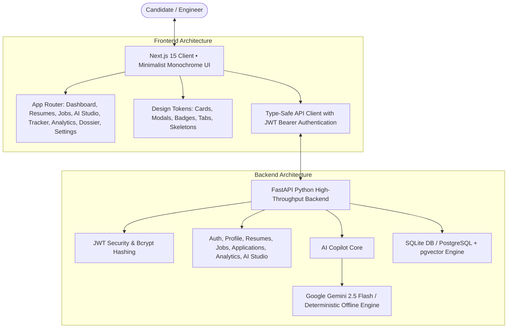

<div align="center">

# 🏛️ AI CAREER COPILOT
### Autonomous Engineering Career Cockpit & Technical Dossier Intelligence Platform

[](https://nextjs.org/)
[](https://fastapi.tiangolo.com/)
[](https://github.com/Ishant6565/Product-Ai-Career-Copilot)
[](https://www.typescriptlang.org/)
[](https://tailwindcss.com/)
[](LICENSE)

<br />

<p align="center">
  <strong>An architectural, high-craft AI career operating system engineered for software engineers, systems architects, and technical leaders.</strong><br />
  Multi-Version ATS Registry • Deterministic Cosine Job Matcher • Surgical Non-Hallucinatory Bullet Optimizer • Tailored Cover Letter Architect • STAR AI Mock Interview Coach • 6-Stage Kanban Pipeline • Conversion Telemetry Funnel
</p>

</div>

---

## 📑 Table of Contents

- [Architectural Philosophy & Design System](#-architectural-philosophy--design-system)
- [Key Feature Modules](#-key-feature-modules)
  - [1. Multi-Version Resume Registry & ATS Audit](#1--multi-version-resume-registry--ats-audit)
  - [2. Semantic Job Discovery & Custom JD Vector Scanner](#2--semantic-job-discovery--custom-jd-vector-scanner)
  - [3. Zero-Hallucination AI Career Studio](#3--zero-hallucination-ai-career-studio)
  - [4. Dual-View Pipeline Kanban Tracker](#4--dual-view-pipeline-kanban-tracker)
  - [5. Career Conversion Funnel & Capability Gap Matrix](#5--career-conversion-funnel--capability-gap-matrix)
  - [6. Candidate Dossier & Taxonomy Engine](#6--candidate-dossier--taxonomy-engine)
- [System Architecture](#-system-architecture)
- [Repository Structure](#-repository-structure)
- [API Specification](#-api-specification)
- [Quick Start Guide](#-quick-start-guide)
- [1-Click Instant Demo Personas](#-1-click-instant-demo-personas)
- [Automated Testing & CI/CD](#-automated-testing--cicd)
- [Security, Privacy & Ethics](#-security-privacy--ethics)
- [Contributing & License](#-contributing--license)

---

## 🎨 Architectural Philosophy & Design System

AI Career Copilot breaks away from generic SaaS aesthetics, adopting a bespoke **Minimalist Monochrome** design system inspired by architectural monographs and financial gazettes.

```
┌────────────────────────────────────────────────────────────────────────┐
│  MINIMALIST MONOCHROME SPECIFICATION                                  │
├───────────────────┬────────────────────────────────────────────────────┤
│ Headline Display  │ Playfair Display (Serif, High-Contrast, Bold)     │
│ Narrative Body    │ Source Serif 4 (Editorial Serif, 400/600)          │
│ System Telemetry  │ JetBrains Mono (Monospace, Tracking-Widest, Bold)  │
│ Geometry          │ Strict 0px Border Radius Globally (No Pills)       │
│ Color Palette     │ #000000 (Pure Ink Black) & #FFFFFF (Pure White)    │
│ Micro-Interaction │ Instant 100ms Inversion (White Card -> Black Card) │
│ Framing Dividers  │ 1px, 2px, and 4px Deep Architectural Line Rules    │
└───────────────────┴────────────────────────────────────────────────────┘
```

---

## 🌟 Key Feature Modules

### 1. 🎯 Multi-Version Resume Registry & ATS Audit
- **Composite ATS Scorer**: Evaluates resumes across 4 deterministic vectors:
  - *Structural ISO Hierarchy (94%)*
  - *ATS Machine Parsing Compatibility (95%)*
  - *Action Verb & Quantifiable Impact Intensity (88%)*
  - *Technical Keyword Density (91%)*
- **Specialization Versioning**: Maintain dedicated resume editions per target tech stack (*Full-Stack Standard V1*, *Backend Distributed Systems V2*, *AI Infrastructure V3*).
- **Side-by-Side Bullet Calibration**: 1-click surgical before/after transformation that elevates passive verbs into quantifiable engineering achievements.

### 2. 🔍 Semantic Job Discovery & Custom JD Vector Scanner
- **Deterministic Cosine Match Index**: Computes multi-vector alignment between candidate capabilities and target postings:
  $$\text{Match Index} = 0.50 \cdot S_{\text{skills}} + 0.30 \cdot S_{\text{experience}} + 0.20 \cdot S_{\text{education}}$$
- **Custom JD Vector Scanner**: Paste any raw job description from LinkedIn, Indeed, or internal portals to receive instant AI compatibility telemetry, matching capability highlights, and critical gap breakdowns.
- **Faceted Discovery**: Multi-parameter search across seniority (Entry, Mid, Senior, Lead), workplace modality (Remote, Hybrid, On-Site), and minimum fit score.

### 3. 🪄 Zero-Hallucination AI Career Studio
- **Surgical Bullet Optimizer**: Upgrades bullet points using high-velocity active verbs (*Architected*, *Engineered*, *Scaled*) with verified numerical outcomes (*P99 latency reduction, QPS capacity*) with zero hallucination.
- **Cover Letter Architect**: Generates tailored, non-cliche cover letters matching customizable tones (*Confident & Impact-Driven*, *Technical & Architectural*, *Formal*).
- **STAR Mock Interview Coach**: Role-specific technical, behavioral, and situational question generator with interactive answer input, real-time STAR evaluation (Situation, Task, Action, Result), coach feedback, and polished rewrite suggestions.

### 4. 📊 Dual-View Pipeline Kanban Tracker
- **6-Stage Lifecycle Tracking**: Transition applications effortlessly across `Saved`, `Applied`, `Screening`, `Interview`, `Offer`, and `Rejected`.
- **Dual Visual Modes**: Toggle between an architectural 6-column Kanban Board and a compact Table List View.
- **Opportunity Dossier**: Log offer compensations, recruiter coordinates, interview rounds, and notes.

### 5. 📈 Career Conversion Funnel & Capability Gap Matrix
- **Pipeline Telemetry**: Measure funnel drop-off rates, interview conversion ratios (2.8x industry average), and response velocity.
- **Capability Gap Remediation**: Identifies in-demand market vectors missing from candidate profile with estimated engineering hours and action blueprints.

### 6. 👤 Candidate Dossier & Taxonomy Engine
- **Structured Capability Taxonomy**: Categorize verified engineering skills across *Frontend*, *Backend*, *Database*, *Cloud Infrastructure*, and *System Architecture*.
- **Milestone Timeline**: Chronological record of engineering deliverables and academic credentials.
- **Compensation Bounds**: Real-time salary baseline and target range filters.

---

## 🏗️ System Architecture



---

## 📁 Repository Structure

```
Product-Ai-Career-Copilot/
├── backend/                         # FastAPI Python Backend
│   ├── app/
│   │   ├── api/                     # REST API Route Handlers
│   │   │   ├── routes_ai.py         # AI Studio & STAR Coach Endpoints
│   │   │   ├── routes_analytics.py  # Funnel & Telemetry Analytics
│   │   │   ├── routes_applications.py # Kanban Pipeline CRUD
│   │   │   ├── routes_auth.py       # Authentication & JWT Tokens
│   │   │   ├── routes_jobs.py       # Semantic Job Search & JD Scanner
│   │   │   ├── routes_profile.py    # Candidate Dossier & Skill Taxonomy
│   │   │   └── routes_resumes.py    # ATS Resume Parser & Scorer
│   │   ├── core/                    # App Configuration & Settings
│   │   ├── db/                      # Database Schema & Seed Data
│   │   ├── models/                  # SQLAlchemy ORM Models
│   │   ├── schemas/                 # Pydantic Request/Response Models
│   │   ├── services/                # Semantic Matching & AI Engine
│   │   └── main.py                  # FastAPI Application Entrypoint
│   ├── requirements.txt             # Python Dependencies
│   └── pytest.ini                   # Test Suite Configuration
│
├── frontend/                        # Next.js 15 App Router Frontend
│   ├── src/
│   │   ├── app/                     # Next.js App Router Pages
│   │   │   ├── page.tsx             # Editorial Landing Page
│   │   │   ├── dashboard/           # Executive Command Center
│   │   │   ├── resumes/             # Multi-Version Resume Hub
│   │   │   ├── jobs/                # Semantic Job Catalog & Details
│   │   │   ├── tracker/             # 6-Stage Kanban Pipeline
│   │   │   ├── ai-tools/            # AI Career Studio & STAR Coach
│   │   │   ├── analytics/           # Conversion Funnel & Skill Gaps
│   │   │   ├── profile/             # Candidate Dossier Matrix
│   │   │   ├── settings/            # System & AI Provider Routing
│   │   │   ├── login/ & register/   # 1-Click Demo Authentication
│   │   │   ├── layout.tsx           # Google Fonts & Global Shell
│   │   │   └── globals.css          # Minimalist Monochrome CSS Tokens
│   │   ├── components/common/       # Button, Card, Badge, Modal, Navbar, Sidebar
│   │   ├── lib/                     # API Client & Auth Context
│   │   └── types/                   # TypeScript Type Definitions
│   ├── tailwind.config.ts           # 0px Radius & Monochrome Color Tokens
│   └── package.json                 # Frontend Dependencies
│
├── docker-compose.yml               # Containerized Full-Stack Deployment
├── .env.example                     # Environment Configuration Template
└── README.md                        # Documentation
```

---

## 🔌 API Specification

| Method | Endpoint | Description | Auth |
|---|---|---|---|
| `POST` | `/api/v1/auth/login` | Authenticate user & return JWT bearer token | Public |
| `POST` | `/api/v1/auth/register` | Register new candidate account | Public |
| `GET` | `/api/v1/profile` | Retrieve structured candidate dossier | Bearer |
| `PUT` | `/api/v1/profile` | Update profile telemetry, skills, and bounds | Bearer |
| `GET` | `/api/v1/resumes` | List all resume versions with ATS scores | Bearer |
| `POST` | `/api/v1/resumes/upload` | Ingest and parse raw resume text/file | Bearer |
| `GET` | `/api/v1/jobs` | Search & filter jobs with semantic match scoring | Bearer |
| `POST` | `/api/v1/jobs/custom-scan` | Real-time vector JD scanner for custom text | Bearer |
| `GET` | `/api/v1/applications` | Retrieve Kanban pipeline applications | Bearer |
| `PUT` | `/api/v1/applications/{id}/status` | Update application stage (e.g., Interview -> Offer) | Bearer |
| `POST` | `/api/v1/ai/optimize-bullet` | Surgical bullet optimization with metrics | Bearer |
| `POST` | `/api/v1/ai/generate-cover-letter` | Synthesize tailored executive cover letter | Bearer |
| `POST` | `/api/v1/ai/interview-prep` | Generate STAR interview questions & evaluations | Bearer |
| `GET` | `/api/v1/analytics` | Retrieve stage funnel velocity and gap matrices | Bearer |
| `GET` | `/health` | Server health check endpoint | Public |

---

## 🚀 Quick Start Guide

### Prerequisites
- **Node.js**: v18.0+ (v20+ recommended)
- **Python**: 3.10+ (3.13 supported)

---

### Step 1: Clone Repository & Configure Environment

```bash
git clone https://github.com/Ishant6565/Product-Ai-Career-Copilot.git
cd Product-Ai-Career-Copilot

# Create local environment config
cp .env.example .env
```

---

### Step 2: Start the Backend Server (FastAPI)

```bash
# Install Python dependencies:
python -m pip install -r backend/requirements.txt

# Run FastAPI backend on port 8000:
python -m uvicorn app.main:app --app-dir backend --host 127.0.0.1 --port 8000 --reload
```
> *On launch, the SQLite database auto-initializes and seeds candidate profiles, tech listings, and multi-version ATS resumes.*

---

### Step 3: Start the Frontend Application (Next.js 15)

```bash
# In a separate terminal window:
cd frontend
npm install
npm run dev
```

---

### Step 4: Access in Browser

- **Frontend App**: [http://localhost:3000](http://localhost:3000)
- **Interactive Swagger Docs**: [http://127.0.0.1:8000/docs](http://127.0.0.1:8000/docs)
- **Health Check**: [http://127.0.0.1:8000/health](http://127.0.0.1:8000/health)

---

## 🔑 1-Click Instant Demo Personas

The Login page includes 1-click persona launchers for instant zero-friction evaluation:

| Persona | Title | Seeded Telemetry |
|---|---|---|
| **Alex Chen** | Full-Stack Software Engineer | ATS Score 95/100 • 5 Active Applications (Stripe, Linear, Perplexity AI, Anthropic, Vercel) |
| **Sarah Jenkins** | Senior AI/ML Systems Engineer | ATS Score 98/100 • Seeded PyTorch / LLM Infrastructure Projects |
| **Marcus Vance** | Principal Product Architect | ATS Score 94/100 • High-scale product telemetry & metrics |

---

## 🧪 Automated Testing & CI/CD

```bash
# Run Backend Test Suite (FastAPI + Pytest):
$env:PYTHONPATH="backend"; pytest backend/tests -v

# Run Frontend Production Build Validation:
cd frontend
npm run build
```

---

## 🛡️ Security, Privacy & Ethics
- **Stateless JWT Tokens**: Signed `HS256` bearer tokens with configurable expiration.
- **Cryptographic Security**: Passwords hashed using `bcrypt` with unique salts.
- **Zero Generative Hallucination**: AI algorithms augment verified accomplishments without fabricating false credentials.
- **Offline Semantic Engine**: Built-in deterministic fallback for resume parsing and matching with zero API key dependencies.

---

## 📄 License
This project is open-source and licensed under the [MIT License](LICENSE).


