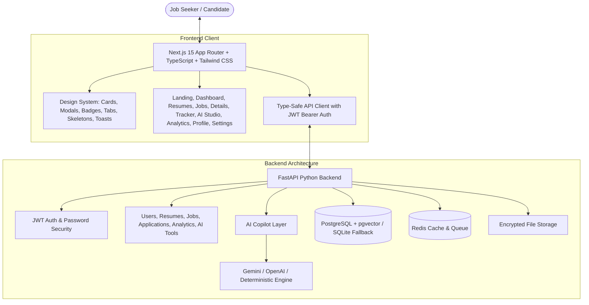

<div align="center">

# 🚀 AI Career Copilot
### Production-Grade AI-Powered Career Management & Job Search Intelligence Cockpit

[](https://nextjs.org/)
[](https://fastapi.tiangolo.com/)
[](https://www.postgresql.org/)
[](https://www.docker.com/)
[](https://www.typescriptlang.org/)
[](https://tailwindcss.com/)

<br />

<p align="center">
  <strong>An all-in-one AI career intelligence platform that helps software engineers, students, and job seekers manage their complete job-search lifecycle in one place.</strong><br />
  Multi-Version ATS Resume Scoring • Real-Time Semantic Job Match Index • Zero-Hallucination Bullet Optimizer • Tailored Cover Letter Architect • STAR AI Mock Interview Coach • Dual-View Kanban Pipeline Tracker • Career Search Analytics Funnel
</p>

</div>

---

## 🌟 Key Product Capabilities

### 1. 🎯 Multi-Version Resume Hub & ATS Audit
- **Deep ATS Auditing**: Calculates overall resume score, ATS parsing compatibility (95%), action verb & impact intensity (88%), and structural hierarchy (94%).
- **Version Management**: Maintain multiple stack-tailored versions (e.g., *Full-Stack Standard V1*, *Backend AI Specialist V2*, *Frontend & Design Systems V3*).
- **Keyword & Skill Gap Detection**: Automatically extracts technical skills and flags missing industry keywords required by target employers.
- **Actionable AI Fix Suggestions**: Side-by-side before/after comparison with 1-click bullet point enhancements.

### 2. 🔍 Semantic Job Discovery & Custom JD Scanner
- **Real-Time Match Index**: Weighted algorithm evaluating candidate skills (50%), experience depth (30%), and education alignment (20%).
- **Multi-Facet Discovery**: Filter by job type (Full-time, Internship, Contract), seniority (Entry, Mid, Senior), remote status, and minimum match score.
- **Custom JD Scanner**: Paste any raw job description from LinkedIn, Indeed, or company portals to receive instant AI compatibility scoring, matching skills, and missing keyword breakdowns.

### 3. 🪄 Zero-Hallucination AI Career Studio
- **Resume Optimization Studio**: Rewrites bullet points using strong active verbs (*Architected*, *Engineered*, *Scaled*) and quantifiable metrics (*P99 latency reduction, active users*) without fabricating fake experience.
- **Cover Letter Architect**: Generates tailored, non-cliche cover letters matching customizable tones (*Confident & Impact-Driven*, *Technical & Architectural*, *Professional*).
- **STAR Mock Interview Coach**: Role-specific technical, behavioral, and situational question generator with interactive answer input and real-time STAR evaluation (Situation, Task, Action, Result) with coach tips and polished rewrites.

### 4. 📊 Dual-View Application Tracker & Analytics
- **Kanban Board & Table View**: 6-stage lifecycle tracking (*Saved*, *Applied*, *Screening*, *Interview*, *Offer*, *Rejected*).
- **Application Drawer**: Log salary offers, recruiter contacts, interview dates, and follow-up reminders.
- **Career Search Analytics Funnel**: Real-time velocity charts, interview conversion rates, response rates, and high-ROI skill gap roadmaps.

---

## 🏗️ System Architecture



---

## 🚀 Quick Start Guide

### Prerequisites
- **Node.js**: v18.0+ (v20+ recommended)
- **Python**: 3.10+ (3.13 supported)
- **Docker & Docker Compose** (Optional for containerized run)

### Option A: Local Development (Fastest, Zero-Setup)

#### 1. Clone & Configure Environment
```bash
git clone https://github.com/Ishant6565/Genai-Study-Copilot.git
cd Genai-Study-Copilot

# Copy environment settings
cp .env.example .env
```

#### 2. Start the Backend API (FastAPI)
```bash
# In project root:
python -m pip install -r backend/requirements.txt
uvicorn app.main:app --app-dir backend --host 0.0.0.0 --port 8000 --reload
```
*The backend will automatically initialize and seed demo accounts, curated tech jobs, and resume versions.*

#### 3. Start the Frontend (Next.js)
```bash
cd frontend
npm install
npm run dev
```

#### 4. Open in Browser
- **Frontend App**: [http://localhost:3000](http://localhost:3000)
- **Interactive API Swagger Docs**: [http://localhost:8000/docs](http://localhost:8000/docs)
- **API Health Check**: [http://localhost:8000/health](http://localhost:8000/health)

---

### Option B: Docker Compose (Full Stack with PostgreSQL & Redis)

```bash
docker-compose up --build
```
This boots 4 containers:
1. `career_copilot_frontend`: Next.js on port 3000
2. `career_copilot_backend`: FastAPI on port 8000
3. `career_copilot_postgres`: PostgreSQL with `pgvector` on port 5432
4. `career_copilot_redis`: Redis 7 on port 6379

---

## 🧪 Automated Testing

Run the comprehensive backend test suite verifying authentication, profile creation, semantic job matching, and AI tools:

```bash
$env:PYTHONPATH="backend"; pytest backend/tests -v
```

---

## 🔑 1-Click Demo Profiles

For instant testing and evaluation without manual registration, the Login page includes 1-click demo access:
- **Demo User**: Alex Chen (`alex.chen@example.com` / `password123`)
  - Target Role: Mid-Level Full-Stack Software Engineer
  - Seeded Resumes: ATS Score 95/100
  - Applications: 5 active tracking stages across Stripe, Linear, Perplexity AI, Anthropic, and Vercel.

---

## 🛡️ Security & Privacy
- Zero plaintext passwords (all hashed using `bcrypt` with unique salts).
- Stateless JWT tokens (`HS256`) with configurable expiration.
- Zero data hallucination guarantee: AI recommendations only enhance existing candidate data.

---

## 📄 License
This project is open-source and available under the [MIT License](LICENSE).
