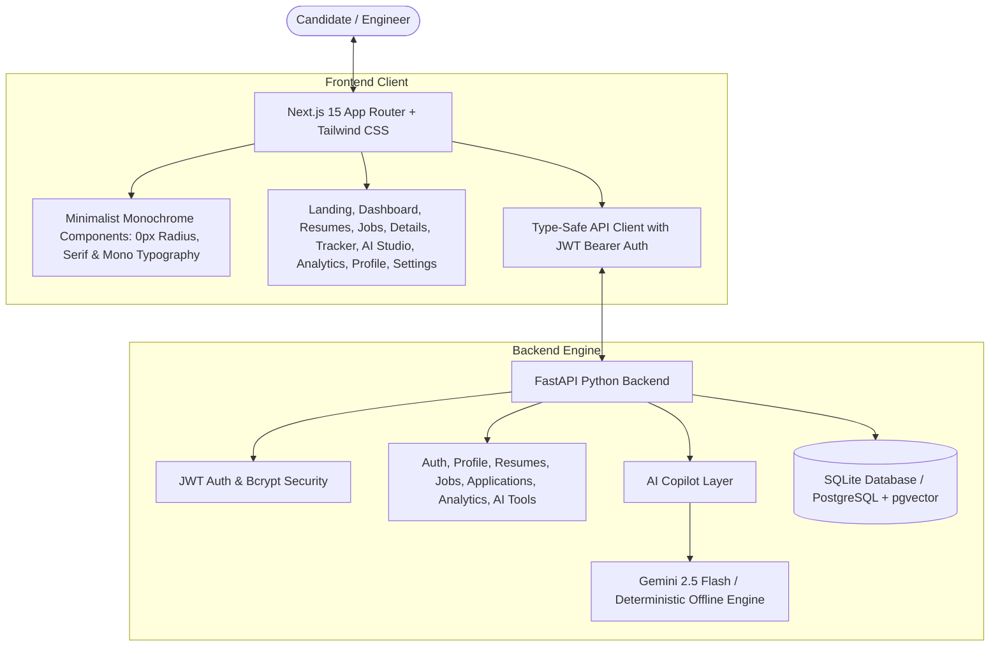

<div align="center">

# 🏛️ AI Career Copilot
### Autonomous AI Career Management & Technical Dossier Intelligence Cockpit

[](https://nextjs.org/)
[](https://fastapi.tiangolo.com/)
[](https://github.com/Ishant6565/Product-Ai-Career-Copilot)
[](https://www.typescriptlang.org/)
[](https://tailwindcss.com/)
[](LICENSE)

<br />

<p align="center">
  <strong>An architectural, high-craft AI career intelligence cockpit designed for software engineers, systems architects, and technical leaders.</strong><br />
  Multi-Version ATS Audit • Deterministic Cosine Job Matcher • Non-Hallucinatory Bullet Optimizer • Tailored Cover Letter Architect • STAR AI Mock Interview Coach • 6-Stage Kanban Pipeline • Conversion Telemetry Funnel
</p>

</div>

---

## 🎨 Minimalist Monochrome Aesthetic

AI Career Copilot features a high-craft **Minimalist Monochrome** design system engineered with editorial precision and zero visual clutter:

- **Editorial Typography Hierarchy**:
  - **Headlines & Mastheads**: `Playfair Display` serif for oversized, authoritative titles.
  - **Narrative & Long-Form**: `Source Serif 4` serif for descriptions, executive summaries, and bullet points.
  - **System Telemetry & Metadata**: `JetBrains Mono` for scores, timestamps, KPIs, tags, and form labels.
- **Strict Geometric Precision**: Global `0px` border-radius across cards, buttons, badges, modals, tabs, and inputs.
- **High-Contrast Palette**: Pure `#000000` (Deep Ink Black), `#FFFFFF` (Pure Crisp White), and architectural neutral grays.
- **Tactile Micro-Interactions**: Instant `100ms` hover color inversions with crisp white text on black background.
- **Deep Architectural Rules**: 1px–4px solid black framing rules and structured technical data grids.

---

## 🌟 Core Product Capabilities

### 1. 🎯 Multi-Version Resume Registry & ATS Audit
- **Deep ATS Auditing**: Calculates composite resume scores, ATS structural compatibility, action verb intensity, and ISO hierarchy.
- **Stack-Specific Versioning**: Maintain dedicated resumes per specialization (*Full-Stack Standard V1*, *Backend Systems V2*, *AI Infrastructure V3*).
- **Keyword Gap Detection**: Extracts verified technical capabilities and flags missing domain keywords required by target postings.
- **Side-by-Side Bullet Calibration**: 1-click surgical before/after bullet point optimization with zero hallucination.

### 2. 🔍 Semantic Job Catalog & Vector JD Scanner
- **Real-Time Match Index**: Weighted algorithm evaluating candidate skills (50%), experience depth (30%), and education alignment (20%).
- **Multi-Facet Filtering**: Filter listings by role type, seniority tier, workplace modality (Remote/Hybrid/On-Site), and fit percentage.
- **Custom JD Vector Scanner**: Paste any raw job description from LinkedIn, Indeed, or internal portals for instant AI match telemetry and gap breakdowns.

### 3. 🪄 Zero-Hallucination AI Career Studio
- **Surgical Bullet Optimizer**: Upgrades bullet points using strong active verbs (*Architected*, *Engineered*, *Scaled*) and quantifiable metrics (*P99 latency, RPS throughput*) without fabricating false history.
- **Cover Letter Architect**: Generates tailored, non-cliche cover letters matching customizable tones (*Confident & Impact-Driven*, *Technical & Architectural*, *Formal*).
- **STAR Mock Interview Coach**: Role-specific technical, behavioral, and situational question generator with real-time STAR evaluation (Situation, Task, Action, Result), coach feedback, and refined answer rewrites.

### 4. 📊 Dual-View Application Pipeline & Telemetry Funnel
- **Kanban Board & Table List**: 6-stage lifecycle tracking (*Saved*, *Applied*, *Screening*, *Interview*, *Offer*, *Rejected*).
- **Opportunity Dossier**: Log salary offers, recruiter notes, interview schedules, and stage transitions.
- **Career Conversion Funnel**: Track stage velocity, interview conversion ratios, response rates, and actionable skill gap remediation roadmaps.

---

## 🏗️ System Architecture



---

## 🚀 Quick Start Guide

### Prerequisites
- **Node.js**: v18.0+ (v20+ recommended)
- **Python**: 3.10+ (3.13 supported)

---

### Step 1: Clone Repository & Configure Environment

```bash
git clone https://github.com/Ishant6565/Product-Ai-Career-Copilot.git
cd Product-Ai-Career-Copilot

# Create environment configuration
cp .env.example .env
```

---

### Step 2: Start the Backend API (FastAPI)

```bash
# Install backend dependencies:
python -m pip install -r backend/requirements.txt

# Start FastAPI server on port 8000:
python -m uvicorn app.main:app --app-dir backend --host 127.0.0.1 --port 8000 --reload
```
> *The backend automatically initializes and seeds candidate dossiers, curated tech listings, and multi-version ATS resumes.*

---

### Step 3: Start the Frontend Client (Next.js 15)

```bash
# In a new terminal window:
cd frontend
npm install
npm run dev
```

---

### Step 4: Access in Browser

- **Frontend App**: [http://localhost:3000](http://localhost:3000)
- **Interactive API Swagger Docs**: [http://127.0.0.1:8000/docs](http://127.0.0.1:8000/docs)
- **API Health Check**: [http://127.0.0.1:8000/health](http://127.0.0.1:8000/health)

---

## 🔑 1-Click Instant Demo Personas

For instant exploration without manual registration, the Login page includes 1-click persona launchers:

| Persona | Role | Seeded Profile Data |
|---|---|---|
| **Alex Chen** | Full-Stack Software Engineer | ATS Score 95/100 • 5 Active Applications (Stripe, Linear, Perplexity AI, Anthropic, Vercel) |
| **Sarah Jenkins** | Senior AI/ML Systems Engineer | ATS Score 98/100 • Seeded PyTorch / LLM Infrastructure Projects |
| **Marcus Vance** | Principal Product Architect | ATS Score 94/100 • Product telemetry & system metrics |

---

## 🧪 Automated Testing & Verification

Run the comprehensive backend and frontend test suites:

```bash
# Run Backend Test Suite:
$env:PYTHONPATH="backend"; pytest backend/tests -v

# Run Frontend Production Build Validation:
cd frontend
npm run build
```

---

## 🛡️ Security & Privacy
- **Stateless JWT Tokens**: Industry-standard `HS256` signed bearer tokens.
- **Cryptographic Password Hashing**: Passwords secured via `bcrypt` with unique salts.
- **Zero Generative Hallucination**: AI algorithms augment existing verified engineering accomplishments without fabricating experience.

---

## 📄 License
This project is open-source and licensed under the [MIT License](LICENSE).

